# WorldTastes
<h4> <b>WorldTastes</b> is an application to share your experiences about hotels, cafes, bars, restaurants etc. </h4>
<a href="https://twitter.com/onur_ustunel"> for contact : twitter.com/onur_ustunel </a>

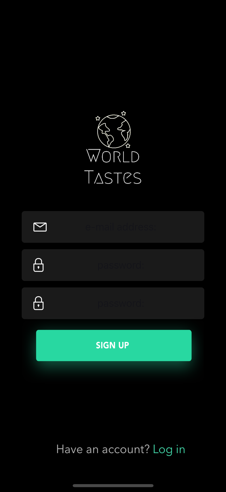
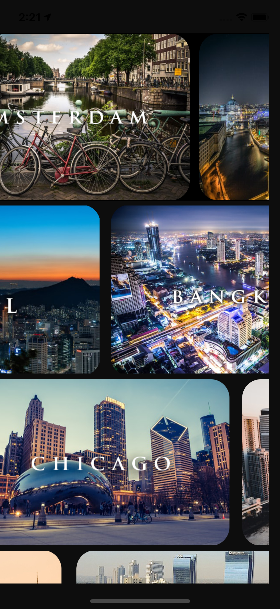
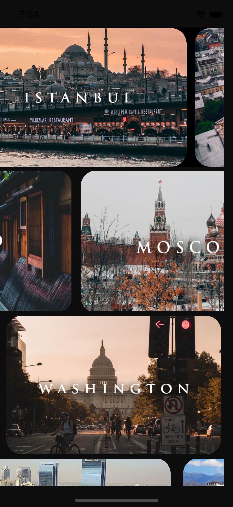
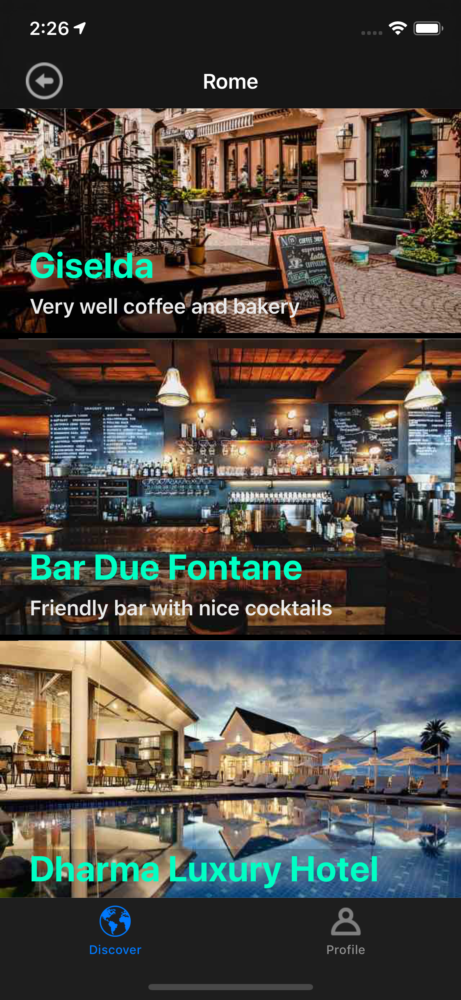
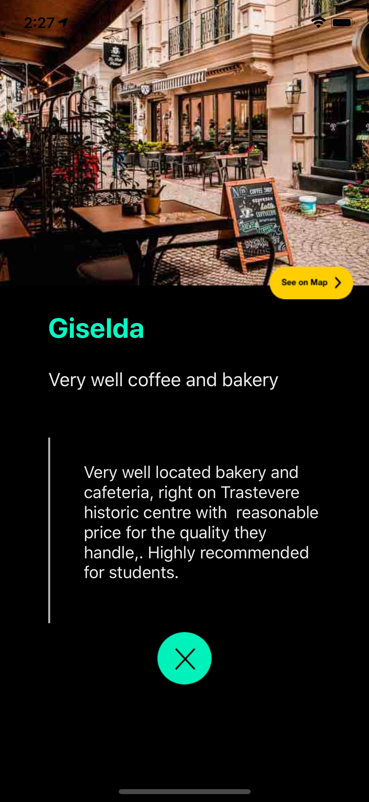
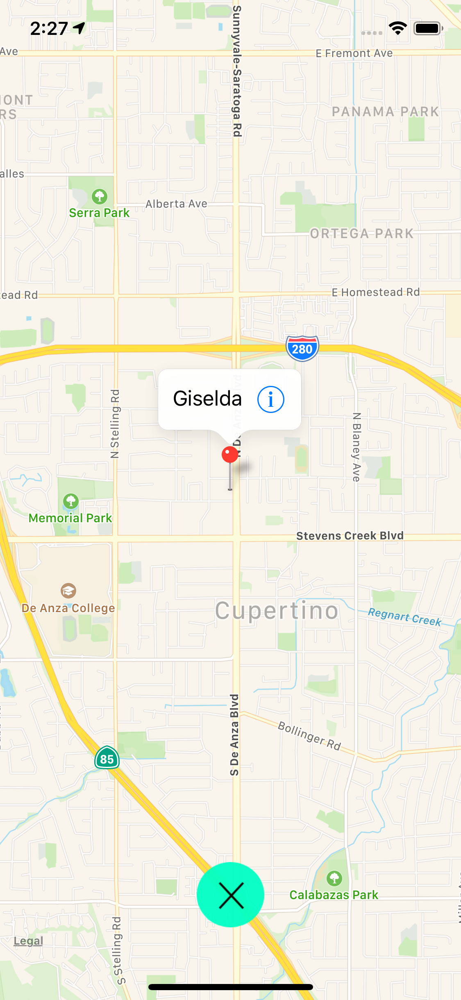
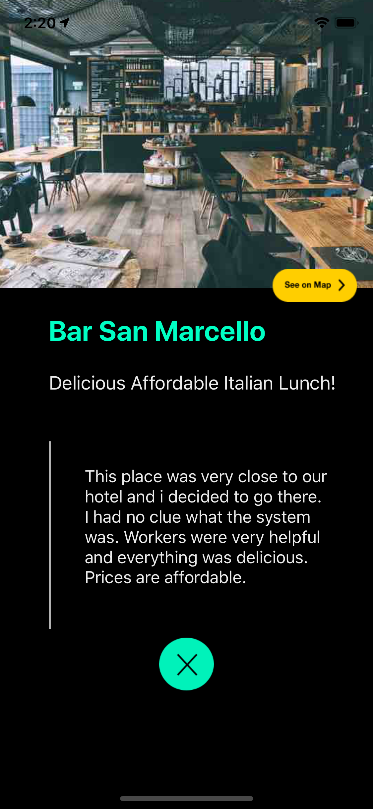
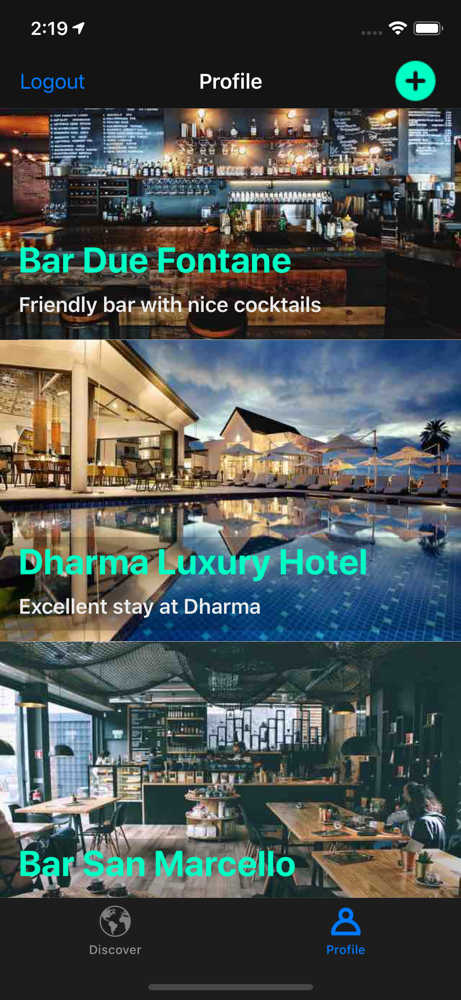
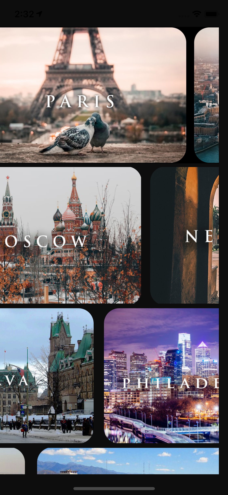
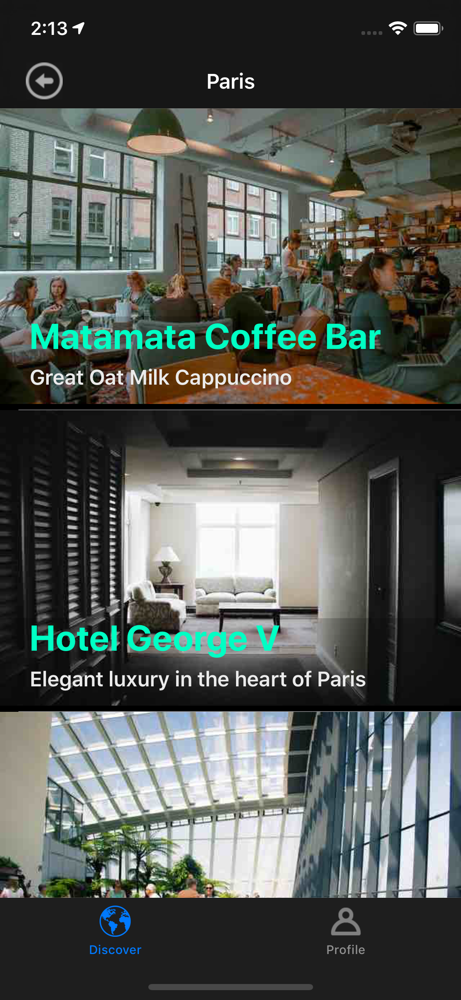
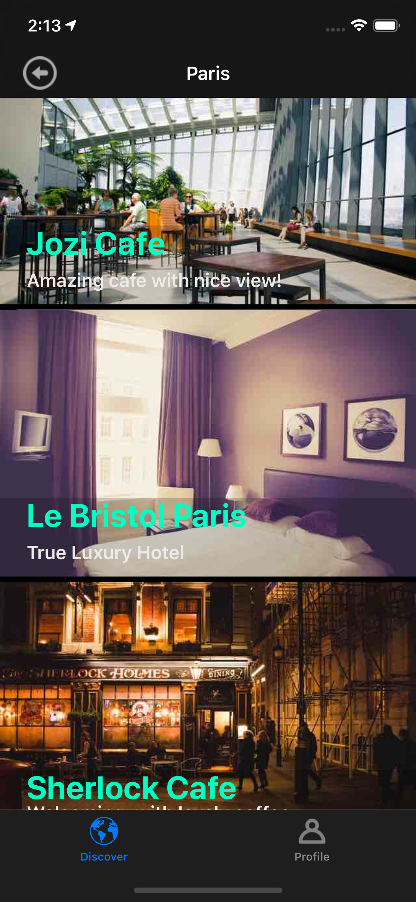
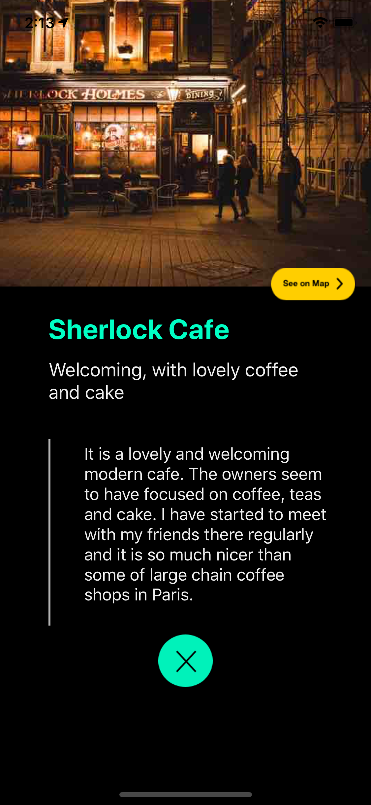
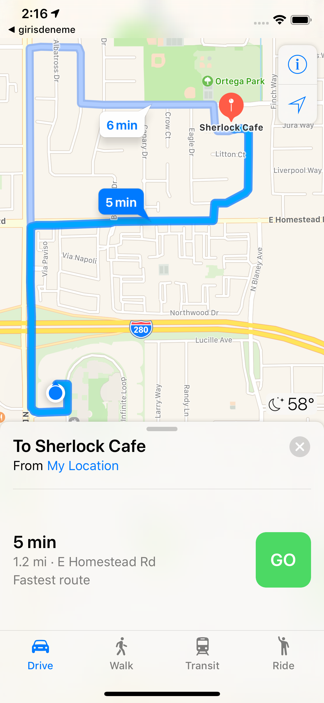
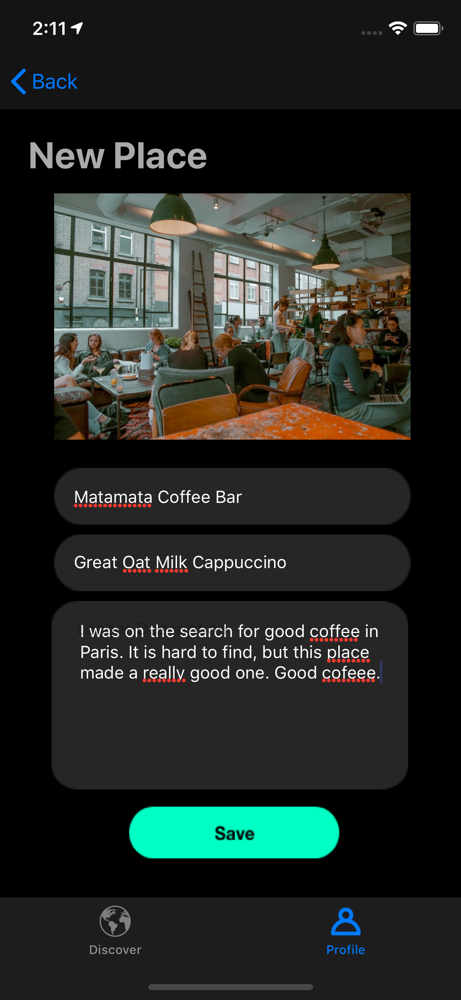

